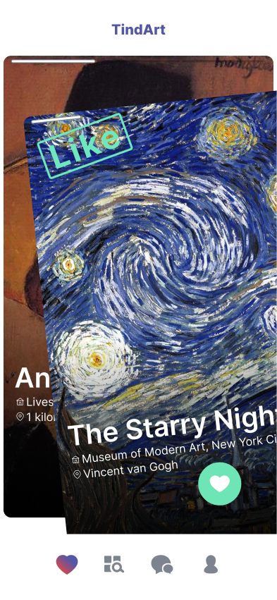

# ArtMatch 🎨✨
**Swipe, Match, and Create Art with AI-Powered Style Analysis**

[](https://vuejs.org/)
[](https://flask.palletsprojects.com/)
[](https://www.scikit-learn.org/)
[](https://supabase.com/)



A Tinder-inspired art discovery platform that combines:
- 🖼️ AI-powered art style analysis
- 💘 Swipe-based artwork matching

## Key Features
### Frontend (Vue.js)
- 🎨 Swipe interface for art discovery
- 📲 Google authentication
- 📊 AI-generated style insights

### Backend (Flask + TensorFlow)
- 🧠 Style classification CNN models
- 🖼️ Neural style transfer implementation
- 🔍 Artwork similarity scoring
- 📈 User preference analysis
- 🔗 Secure API endpoints

## Tech Stack
**Frontend**  
Vue.js

**Backend**  
Flask | OpenCV | NumPy

**AI/ML**  
Scikit-learn

**Database**  
Supabase (PostgreSQL)
Huggingface dataset

## Installation
### Frontend Setup
```bash
cd client
npm install
npm run dev
